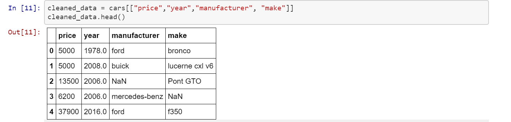
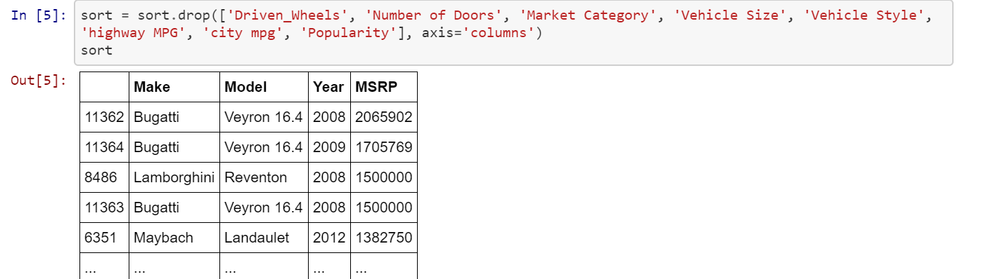
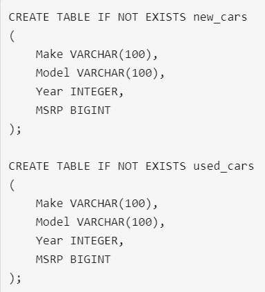

# ETL_project
THE CARS: ETL
By: Nathan Higley, Karl Unverferth & Chad Gielow

SUMMARY

	For this project we performed ETL procedures to explore the data around new and used cars and pricing. 

EXTRACTION

	Two data sources were used to build this project, both were captured from Kaggle.com as CSV files. The first file was data 	related to all used car sales on craigslist across North America. Make, Model, Year, price & links to the posting were all included in the data. The 2nd file was data related to new car sales and included Make, Model, Year & MSRP. 
	1.	Used Car data: cleaned_used_car.csv
	2.	New Car data: new_cars2.0.csv

TRANSFORMATION
	
	Cleaning the data first required us opening the CSV Files in Jupyter Notebook books. From there we wrote several lines of code that would transform the data into a format that allowed for us to create a SQL database that would allow for us to load and query the information.

	Used Car Data: Dropped Columns, Rename Columns & export as a new CSV 
	New Car Data: Sorting Data, Dropping Columns 
 
 

LOAD

	The last step was to transfer our cleaned CSV Files into a DataBase. The database was created with two tables to match the columns from the CSV files so they could import into the SQL database. Once the data was loaded into the SQL database queries can be ran to answer questions that we have about the value of new and used cars.
 
 
